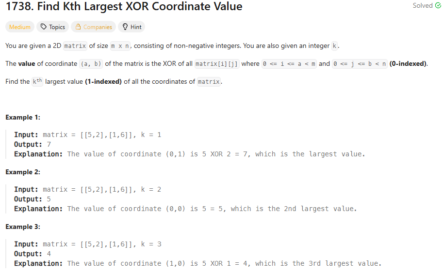
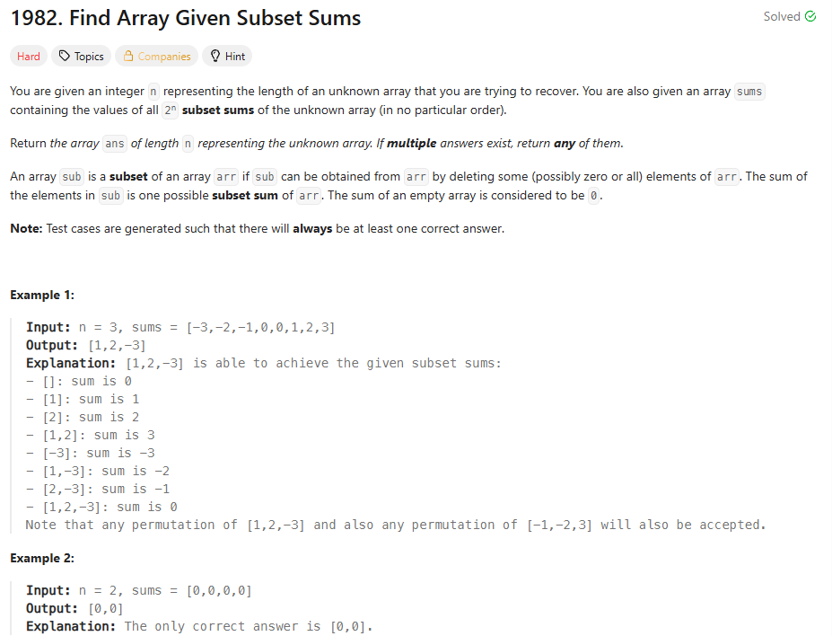
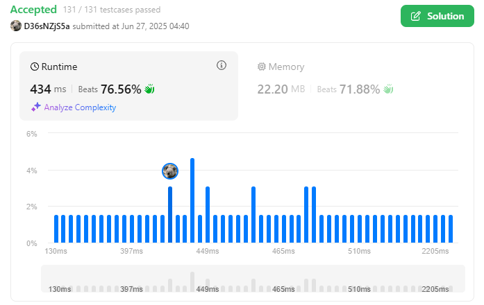
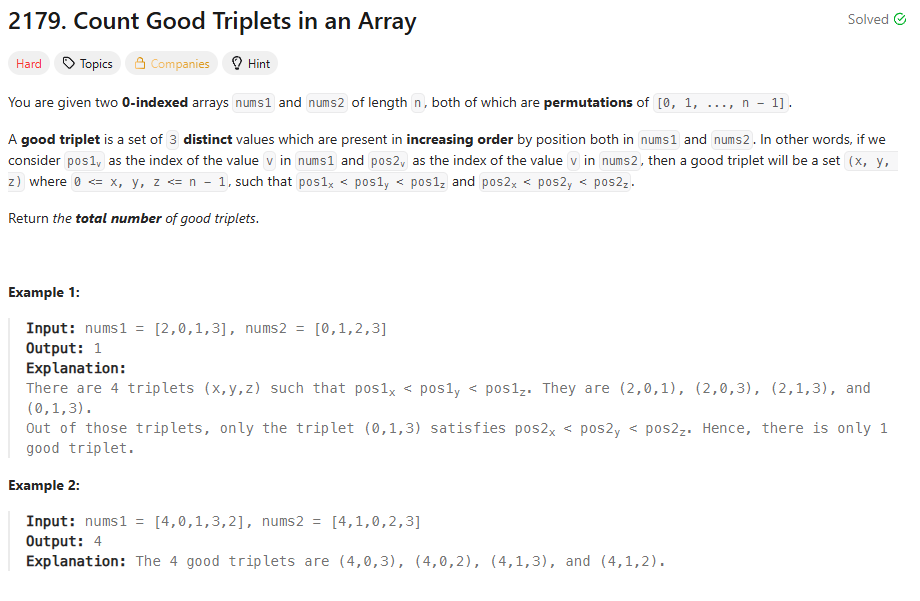
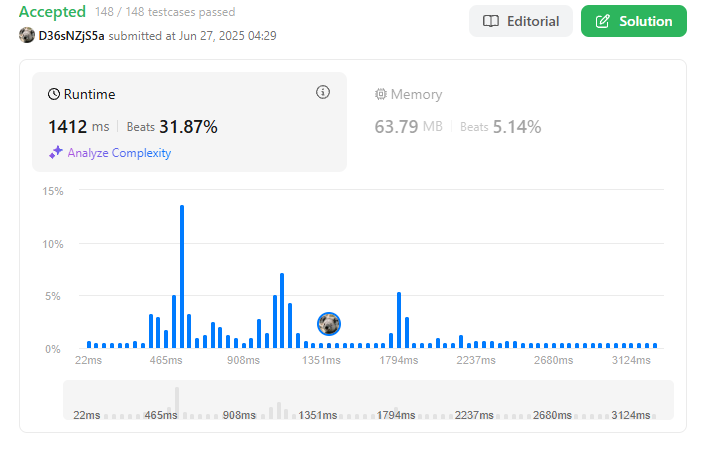

# Greed_code

# Exercícios LeetCode

- **Conteúdo da Disciplina**: Dividir e Conquistar  
- [**Vídeo da Apresentação**](https://youtu.be/32cqBmE11i8)  

## Alunos
|Matrícula | Aluno |GitHub|
| -- | -- | -- |
| 19/0102683  | Antônio José Magalhães Leão Júnior |[antonioleaojr](https://github.com/antonioleaojr)|

## Vídeo da Apresentação
Acesse o vídeo de explicação das resoluções [clicando aqui](https://youtu.be/32cqBmE11i8).

## Sobre 
Este repositório tem como objetivo resolver exercícios sobre algoritmos de Dividir e Conquistar do [LeetCode](https://leetcode.com/).

|Exercício | Dificuldade |
| -- | -- |
|[1738](https://leetcode.com/problems/find-kth-largest-xor-coordinate-value/description)|🟡 Médio|
|[1982](https://leetcode.com/problems/find-array-given-subset-sums/description/)|🔴 Difícil|
|[2179](https://leetcode.com/problems/count-good-triplets-in-an-array/description/)|🔴 Difícil|

## Screenshots

### Exercício 1 - [Find Kth Largest xor Coordinate Value](https://leetcode.com/problems/find-kth-largest-xor-coordinate-value/description)
Resolução em Código: [1738](códigos/1738.py)

  
<strong>Imagem 1 - Questão 1738</strong>

  
<strong>Imagem 2 - Exercício 1738 Aceito</strong>

### Exercício 2 - [Find Array Given Subset Sums](https://leetcode.com/problems/find-array-given-subset-sums/description/)

Resolução em Código: [1982](códigos/1982.py)

  
<strong>Imagem 3 - Questão 1982</strong>

  
<strong>Imagem 4 - Exercício 1982 Aceito</strong>

### Exerício 3 - [Count Good Tiplets In An Array](https://leetcode.com/problems/count-good-triplets-in-an-array/description/)

Resolução em Código: [2179](códigos/2179.py)

  
<strong>Imagem 5 - Questão 2179</strong>

  
<strong>Imagem 6 - Exercício 2179 Aceito</strong>

## Instalação 
**Linguagem**: Python
- Para os testes e julgamentos automáticos, os códigos devem ser executados no LeetCode.

## Uso 
Entrar no link da questão do LeetCodee, escolher Python e colocar o código para ser submetido aos testes.
  
